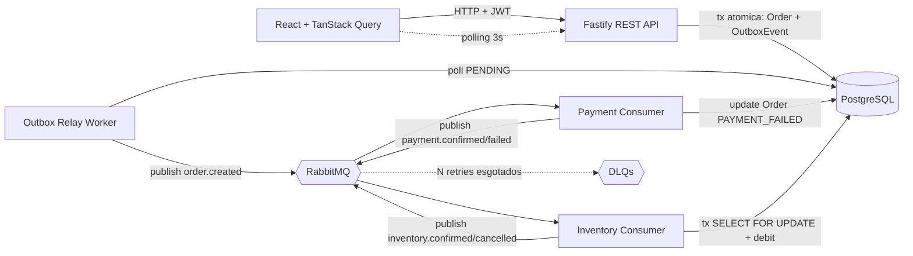
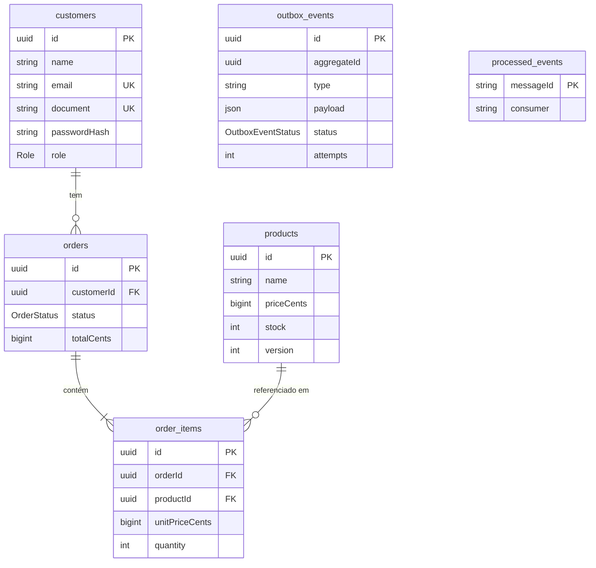
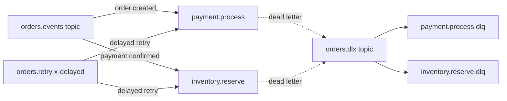
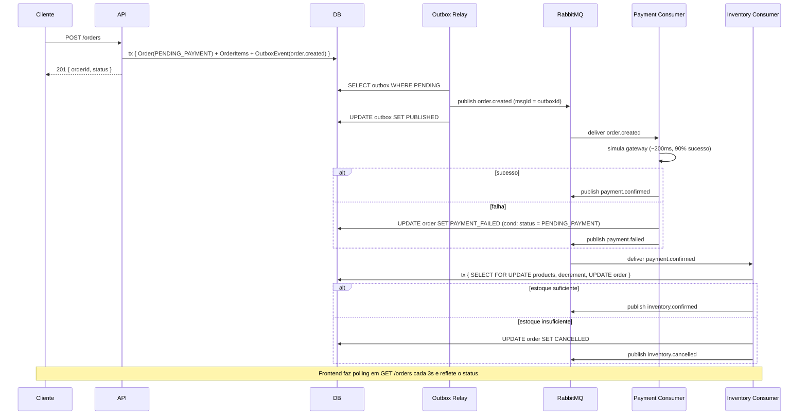

# RayLabs E-commerce — Desafio Técnico Fullstack Event-Driven

Sistema de e-commerce com fluxo síncrono (REST API) e fluxo assíncrono (event-driven) usando **Node.js + TypeScript**, **PostgreSQL**, **RabbitMQ** e **React**.

> Desafio completo com **os bônus** (DLQ, retry exponencial, outbox pattern, lock pessimista, JWT com roles, Docker Compose, frontend React com polling).

---

## Sumário

- [Como rodar (Docker Compose)](#como-rodar-docker-compose)
- [Arquitetura](#arquitetura)
- [Modelo de dados](#modelo-de-dados)
- [Topologia RabbitMQ](#topologia-rabbitmq)
- [Fluxo de eventos](#fluxo-de-eventos)
- [Endpoints REST](#endpoints-rest)
- [Bônus implementados](#bônus-implementados)
- [Trade-offs e decisões](#trade-offs-e-decisões)
- [Como rodar testes](#como-rodar-testes)
- [Estrutura do projeto](#estrutura-do-projeto)
- [Desenvolvimento local (sem Docker do app)](#desenvolvimento-local-sem-docker-do-app)

---

## Como rodar (Docker Compose)

Pré-requisito: **Docker Desktop** com Compose v2.

```bash
git clone https://github.com/thiagovonsohsten/raylabs-e-commerce.git
cd RayLabs
cp .env.example .env
docker compose up --build
```

Serviços que sobem:

| Serviço             | Porta  | Descrição                                    |
| ------------------- | ------ | -------------------------------------------- |
| `frontend`          | 5173   | UI React (nginx)                             |
| `api`               | 3000   | REST API + Swagger em `/docs`                |
| `payment-consumer`  | —      | Consumer assíncrono de pagamento             |
| `inventory-consumer`| —      | Consumer assíncrono de estoque               |
| `outbox-relay`      | —      | Worker de Outbox Pattern                     |
| `postgres`          | 5432   | Banco de dados                               |
| `rabbitmq`          | 5672 / 15672 | Broker + management UI               |

Acesse:

- **App**: http://localhost:5173
- **Swagger**: http://localhost:3000/docs
- **RabbitMQ Management**: http://localhost:15672 (`raylabs / raylabs`)

A API roda `prisma migrate deploy` no startup. Após subir, **rode o seed** uma única vez para popular dados demo:

```bash
docker compose exec api node -e "require('./node_modules/.bin/prisma') || console.log('use prisma cli')"
docker compose exec api npx prisma db seed
```

> Ou simplesmente: `docker compose run --rm api npx prisma db seed`.

**Credenciais demo** após o seed:

- **Cliente**: `cliente@raylabs.dev / cliente123`
- **Admin**:   `admin@raylabs.dev / admin123`

---

## Arquitetura

Arquitetura limpa em camadas (DDD-light) + processos separados para API, consumers e outbox-relay (escala horizontal independente).



### Princípios

- **Clean Architecture**: `domain → application → infrastructure → interfaces`. Use-cases não conhecem Prisma nem Fastify, recebem **portas** (interfaces).
- **DDD light**: entidades com invariantes, value objects (`Email`, `Document`, `Money`), state machine no agregado `Order`.
- **Event-driven**: estado dos pedidos evolui exclusivamente por eventos, não por chamadas síncronas entre módulos.
- **Processos separados**: API (HTTP), `payment-consumer`, `inventory-consumer`, `outbox-relay`. Cada um pode escalar independentemente.

---

## Modelo de dados



Detalhes:

- **`priceCents` / `totalCents`** são `BigInt` (centavos). Evita erros de ponto flutuante.
- **`Product.version`** habilita optimistic lock se necessário no futuro; o débito de estoque atual usa `SELECT ... FOR UPDATE` (pessimista).
- **`OutboxEvent`** garante atomicidade pedido↔evento.
- **`ProcessedEvent`** (PK = `messageId`) garante idempotência por consumer.

---

## Topologia RabbitMQ



- Exchange principal **`orders.events`** (topic) recebe todos os eventos.
- Exchange **`orders.retry`** (`x-delayed-message`) reagenda mensagens com delay.
- Exchange **`orders.dlx`** + filas `*.dlq` recebem mensagens que esgotaram tentativas.
- Cada fila principal está vinculada à exchange principal **e** à retry — sem reprocessar manualmente.

### Estratégia de retry/DLQ

Implementada em [`backend/src/infrastructure/messaging/rabbitmq-consumer.ts`](backend/src/infrastructure/messaging/rabbitmq-consumer.ts):

1. Handler lança exceção em falha.
2. Wrapper lê header `x-attempts` (0 inicialmente).
3. Se `attempts + 1 < MAX_DELIVERY_ATTEMPTS` (default 4):
   - Republica em `orders.retry` com `x-delay = RETRY_BASE_DELAY_MS * 2^attempts` → **1s, 2s, 4s, 8s**.
   - Faz `ack` da original (já reentregue via retry).
4. Caso contrário: `nack(requeue=false)` → vai para a DLQ correspondente.

### Idempotência

`PrismaIdempotencyStore` consulta/grava em `processed_events` por `(messageId, consumer)`. Se o mesmo evento for entregue 2x (at-least-once), o handler abandona silenciosamente.

---

## Fluxo de eventos



Estados terminais: `CONFIRMED`, `CANCELLED`, `PAYMENT_FAILED`. A entidade `Order` rejeita transições a partir de estados terminais.

---

## Endpoints REST

| Método | Rota                      | Auth         | Descrição                              |
| ------ | ------------------------- | ------------ | -------------------------------------- |
| POST   | `/auth/register`          | público      | Registro de cliente                    |
| POST   | `/auth/login`             | público      | Login → JWT                            |
| GET    | `/customers/me`           | autenticado  | Dados do próprio cliente               |
| GET    | `/customers/:id`          | dono ou ADMIN| Detalhe de cliente                     |
| GET    | `/customers`              | ADMIN        | Listar clientes                        |
| GET    | `/products`               | público      | Listar produtos                        |
| GET    | `/products/:id`           | público      | Detalhe                                |
| POST   | `/products`               | ADMIN        | Criar produto                          |
| PUT    | `/products/:id`           | ADMIN        | Atualizar                              |
| DELETE | `/products/:id`           | ADMIN        | Remover                                |
| POST   | `/orders`                 | autenticado  | Criar pedido (publica `order.created`) |
| GET    | `/orders`                 | autenticado  | CUSTOMER: próprios; ADMIN: todos       |
| GET    | `/orders/:id`             | dono ou ADMIN| Detalhe                                |
| GET    | `/healthz`, `/readyz`     | público      | Health checks                          |

**Documentação OpenAPI completa**: http://localhost:3000/docs (Swagger UI).

---

## Bônus implementados

Todos os bônus do enunciado foram entregues:

| Bônus                                     | Onde está                                                                                                          |
| ----------------------------------------- | ------------------------------------------------------------------------------------------------------------------ |
| **DLQ por consumidor**                    | [`topology.ts`](backend/src/infrastructure/messaging/topology.ts), [`rabbitmq-connection.ts`](backend/src/infrastructure/messaging/rabbitmq-connection.ts) |
| **Retry com backoff exponencial**         | [`rabbitmq-consumer.ts`](backend/src/infrastructure/messaging/rabbitmq-consumer.ts) — header `x-delay` via `x-delayed-message` |
| **Estoque sem race condition (lock pessimista)** | [`prisma-product-repository.ts#debitStockBatch`](backend/src/infrastructure/repositories/prisma-product-repository.ts) — `SELECT ... FOR UPDATE` em transação |
| **Outbox pattern**                        | [`prisma-order-repository.ts#createWithOutbox`](backend/src/infrastructure/repositories/prisma-order-repository.ts) + [`outbox-relay.ts`](backend/src/interfaces/consumers/outbox-relay.ts) |
| **JWT + roles ADMIN/CUSTOMER**            | [`auth-plugin.ts`](backend/src/interfaces/http/auth-plugin.ts) — middleware `app.authorize(roles)` |
| **Docker Compose com tudo**               | [`docker-compose.yml`](docker-compose.yml) — 7 serviços com healthchecks |
| **Idempotência at-least-once**            | [`prisma-idempotency-store.ts`](backend/src/infrastructure/repositories/prisma-idempotency-store.ts) |
| **Frontend React (Products, Checkout, MyOrders)** | [`frontend/`](frontend) — polling de 3s em `MyOrders` via TanStack Query |

---

## Trade-offs e decisões

### Por que RabbitMQ (e não Kafka)?

Kafka é excelente para alto throughput e replay histórico, mas para um sistema de pedidos com volume baixo e necessidade de **DLQ + retry com delay** o RabbitMQ é mais simples:

- DLX é **nativo** (parâmetro de fila).
- O plugin oficial `x-delayed-message` resolve retry exponencial sem código de scheduler.
- Routing key permite topologia "1 evento → N consumidores" sem partitions.
- Em Kafka teríamos que implementar retry manualmente (tópicos `*.retry.1`, `*.retry.2`...).

### Lock pessimista vs. optimistic

O `Product` tem coluna `version` (preparada para optimistic), mas o débito de estoque usa **`SELECT ... FOR UPDATE`** porque:

- O caso de uso é "decrementar contador" — alta contenção e re-execução barata.
- Optimistic lock obrigaria retry em loop quando muitos pedidos competem pelo mesmo produto.
- Pessimista garante avanço (cada transação trava em ordem fixa de id, evitando deadlock).

Alternativa testada: `UPDATE products SET stock = stock - $qty WHERE id = $id AND stock >= $qty` é elegante mas não permite verificar quais itens falharam num **batch atômico** com vários produtos.

### Outbox pattern vs. publicação direta

Publicar diretamente do controller para o RabbitMQ tem 2 modos de falha:

1. Crash entre `commit` e `publish` → estado salvo, evento perdido.
2. `commit` falha após `publish` → evento publicado, pedido nunca existiu.

Outbox elimina ambos: pedido + evento são gravados na **mesma transação**. O relay é at-least-once (o publisher idempotente do RabbitMQ + idempotência do consumer cobrem duplicatas).

Trade-off: ~1s de latência (intervalo do poll). Aceitável para pedidos.

### Por que não SAGAs / Choreography mais sofisticada?

Como só temos 2 passos (pagamento → estoque) e a compensação em caso de falha de estoque é **apenas atualizar o status** (sem reembolso, já que o pagamento foi simulado), uma máquina de estados explícita no agregado `Order` é suficiente. Para mais passos eu introduziria um `Saga Orchestrator`.

### TanStack Query polling vs. WebSocket

Para o desafio, polling de 3s é mais simples e suficiente. Em produção, WebSocket ou SSE entregaria atualizações em sub-segundo, mas com complexidade extra (conexão persistente, reconexão, autenticação).

---

## Como rodar testes

### Backend

Pré-requisito: PostgreSQL na `DATABASE_URL` (use `docker compose up -d postgres`).

```bash
cd backend
npm install
npm run prisma:generate

# Unit (puro, sem dependências externas)
npm run test:unit

# Integração (precisa do Postgres rodando)
npm run test:integration

# Tudo
npm test
```

### Tests cobrem

**Unit (29 testes)**:
- Value objects: `Email`, `Document` (CPF e CNPJ válidos/inválidos), `Money` (sem floating point).
- Entidade `Order`: state machine completa, estados terminais, cálculo de total.
- Use-cases: `RegisterCustomerUseCase` (3 cenários), `CreateOrderUseCase` (5 cenários).

**Integration (8 testes)**:
- `Create Order + Outbox`: pedido + outbox event criados na mesma transação; estoque NÃO debitado na criação.
- **Race condition de estoque**: 10 débitos concorrentes em produto com estoque 5 → exatamente 5 sucessos, 5 falhas, estoque final = 0.
- Débito acima do disponível: retorna `insufficient` sem decrementar.
- Atomicidade de batch: se 1 produto falha, nenhum é decrementado.
- Inventory consumer: estoque suficiente → `CONFIRMED` + `inventory.confirmed`; insuficiente → `CANCELLED` + `inventory.cancelled`.
- Idempotência: mesma mensagem 2x não duplica débito.

---

## Estrutura do projeto

```
RayLabs/
├── docker-compose.yml          # 7 serviços com healthchecks
├── .env.example
├── docker/rabbitmq/            # Imagem custom com x-delayed-message plugin
├── backend/
│   ├── src/
│   │   ├── domain/             # Entities, VOs, enums, eventos
│   │   ├── application/        # Use-cases + ports (interfaces)
│   │   ├── infrastructure/     # Prisma, RabbitMQ, JWT, bcrypt
│   │   ├── interfaces/
│   │   │   ├── http/           # Fastify routes, error handler, auth plugin
│   │   │   └── consumers/      # outbox-relay, payment, inventory
│   │   ├── shared/             # logger, config, errors
│   │   └── main/               # 4 bootstraps (api, payment, inventory, outbox)
│   ├── prisma/                 # schema, migrations, seed
│   └── tests/{unit,integration}
└── frontend/
    ├── src/
    │   ├── pages/              # Login, Register, Products, Checkout, MyOrders
    │   ├── components/         # Layout, StatusBadge
    │   ├── api/                # axios client com interceptor JWT
    │   ├── store/              # zustand: auth + cart (persistido)
    │   └── App.tsx, main.tsx
    └── nginx.conf              # SPA fallback
```

---

## Desenvolvimento local (sem Docker do app)

Para iterar rápido sem rebuildar imagens:

```bash
# Sobe só infraestrutura
docker compose up -d postgres rabbitmq

# Backend (4 terminais)
cd backend
cp .env.example .env
npm install
npm run prisma:migrate:dev
npm run prisma:seed

npm run dev:api          # terminal 1
npm run dev:outbox       # terminal 2
npm run dev:payment      # terminal 3
npm run dev:inventory    # terminal 4

# Frontend
cd frontend
npm install
npm run dev              # http://localhost:5173
```

Variáveis principais (em `backend/.env`):

| Variável                  | Default     | Descrição                                |
| ------------------------- | ----------- | ---------------------------------------- |
| `MAX_DELIVERY_ATTEMPTS`   | 4           | Máximo de tentativas antes de DLQ        |
| `RETRY_BASE_DELAY_MS`     | 1000        | Base do backoff exponencial              |
| `PAYMENT_SUCCESS_RATE`    | 0.9         | Taxa de aprovação simulada               |
| `PAYMENT_PROCESSING_MS`   | 500         | Latência simulada do gateway             |
| `OUTBOX_POLL_INTERVAL_MS` | 1000        | Intervalo do relay                       |

---

## Validação manual ponta-a-ponta

1. Login: `POST /auth/login { email: cliente@raylabs.dev, password: cliente123 }` → token JWT.
2. `GET /products` → escolha o id de um produto com estoque.
3. `POST /orders { items: [{productId, quantity: 2}] }` → retorna `{ status: "PENDING_PAYMENT" }`.
4. Aguarde ~3 segundos.
5. `GET /orders/:id` → status agora é `CONFIRMED` (ou `CANCELLED` se você usou um produto sem estoque, ou `PAYMENT_FAILED` em ~10% dos casos).

No frontend (`http://localhost:5173/orders`) o status muda automaticamente via polling.

---

## Licença

MIT — desafio técnico sem restrições de uso.
